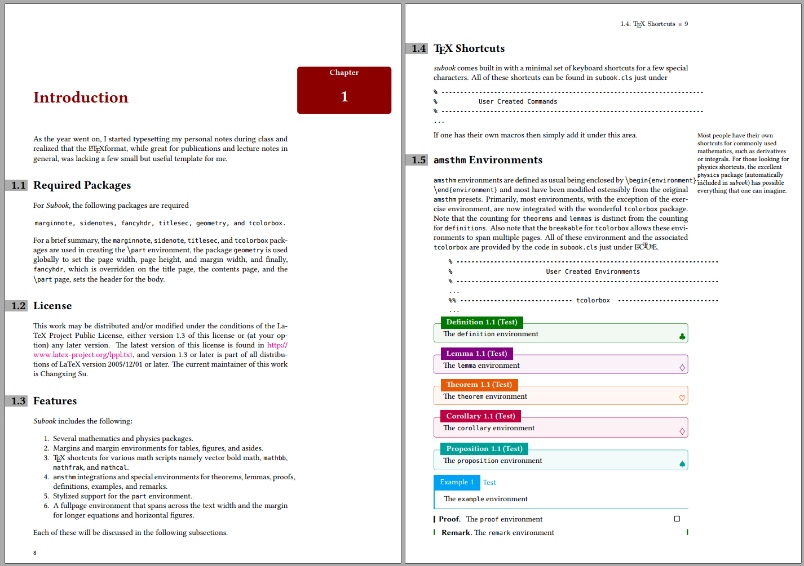
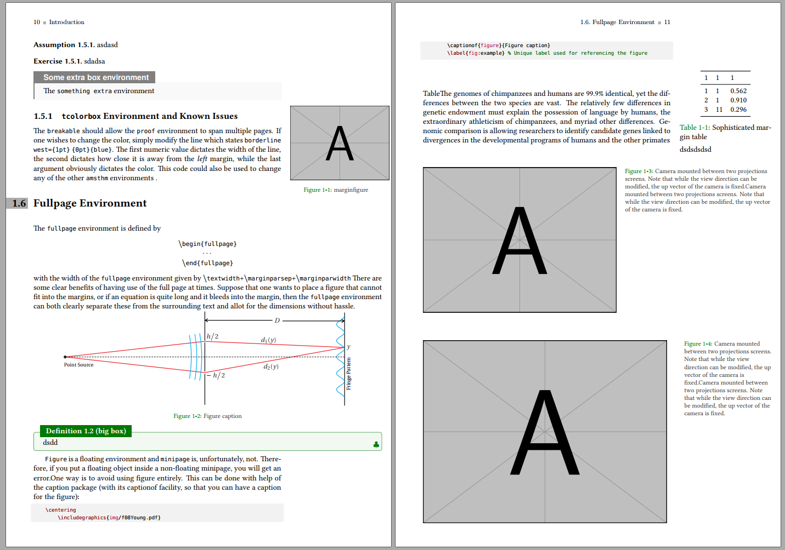

<!-- Author : Dongsheng Deng & Liam Huang-->
<!-- Program Email: elegantlatex2e@gmail.com -->

# SUBOOK(BETA):An LaTeX Template for Books
STILL IN DEVELOPING
## Feature
* Margin Notes
* Minitoc
* Colorful Box
* Bib for each chapter
* Header and footer
* Full page Environment

TO DO：
* Simple and beautiful
* Summary Environment
* 习题链接
* Beautiful Cover and contents
* idx page
## Overview

## Goal
The central focus of this template was to expand the use of the margin in order to include; simple marginnotes, numbered side–notes, marginfigures, and margintables. 

The secondary motivation was to include a list of
preloaded packages that any physics or mathematics students would require while type–setting notes. 

Lastly, there are a few stylistic improvements that allow for better readability.

## License

This work may be distributed and/or modified under the conditions of the LaTeX
Project Public License, either version 1.3 of this license or (at your option) any laterversion. The latest version of this license is found [here](http://www.latex-project.org/lppl.txt), and version 1.3 or later is part of all distributions of LaTeX version 2005/12/01 or later.

## Thanks
Thanks to [Notestex](https://github.com/Adhumunt/NotesTeX),[elegantbook](https://github.com/ElegantLaTeX/ElegantBook).