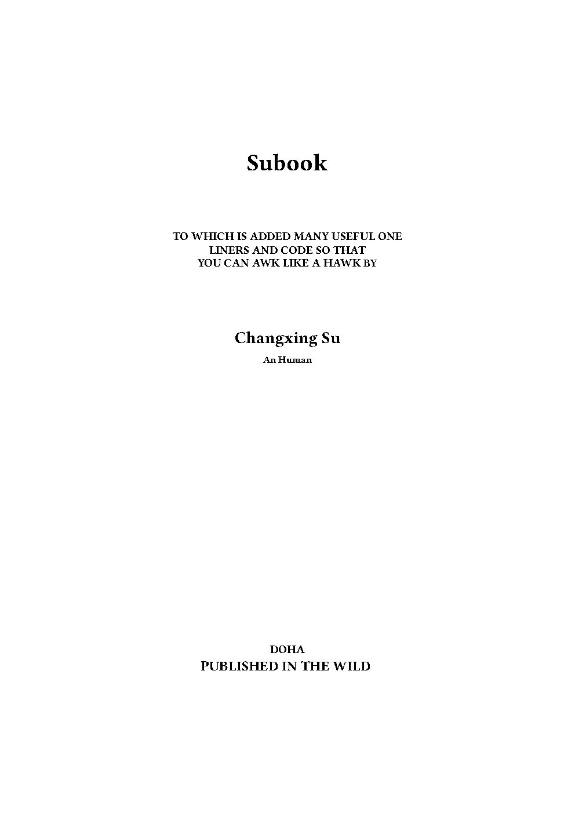
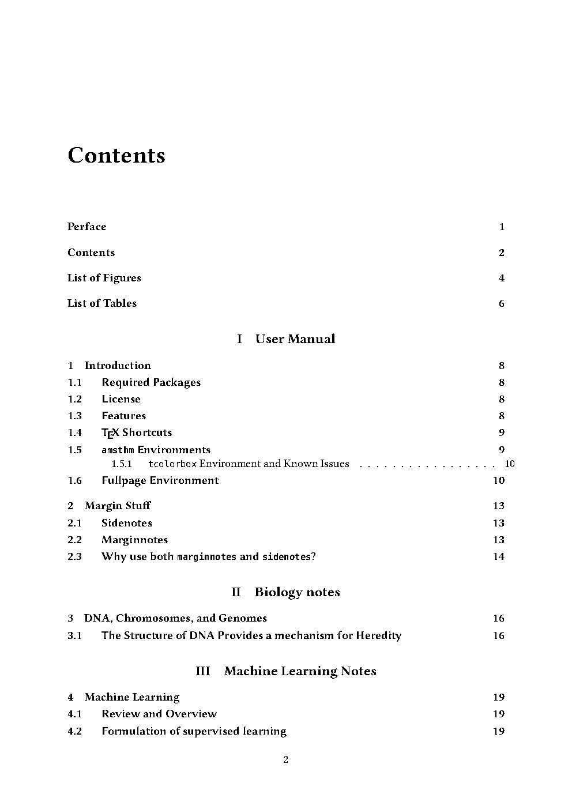
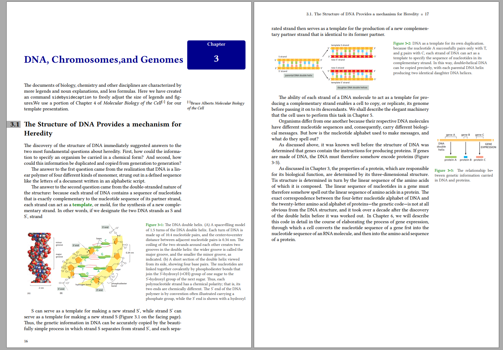
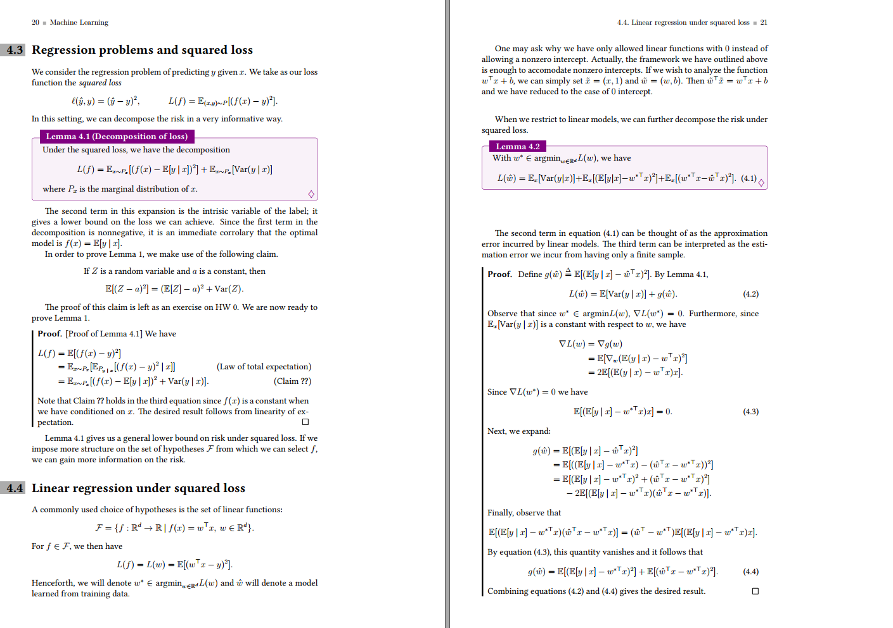
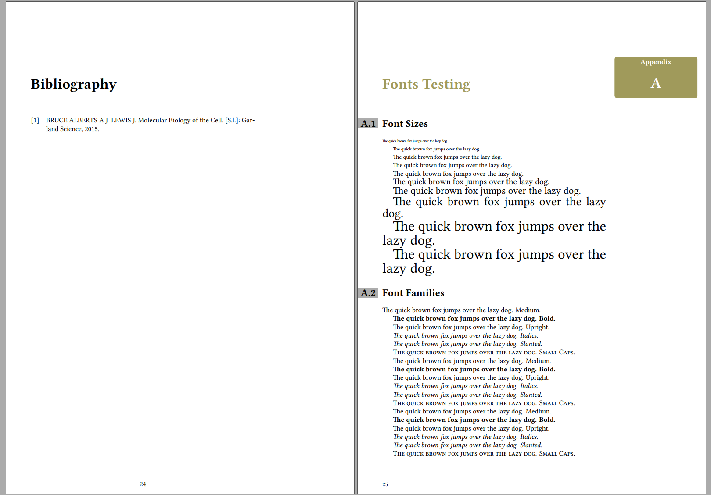
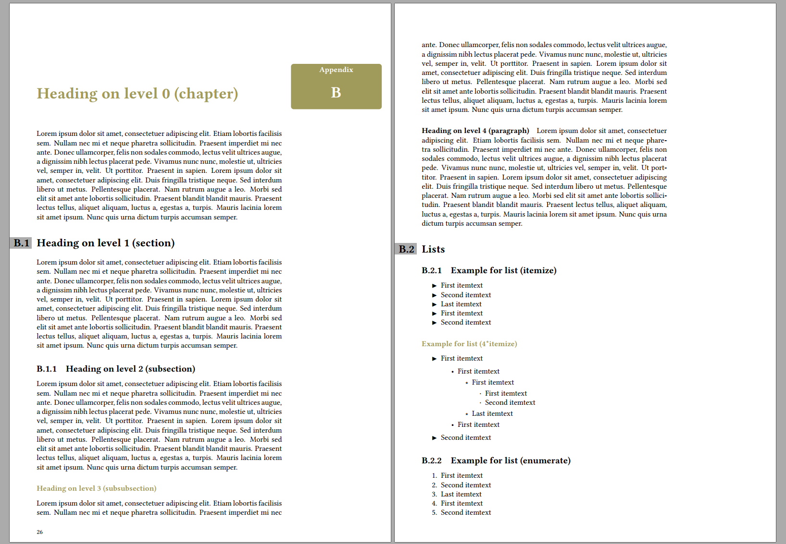

<!-- Author : Changxing Su-->

<div align="center">

#  SuBook
##  🎨 A simple beautiful LaTeX theme for book, thesis, note.

</div>


This book template provides a starting point upon which authors may freely build to generate their own textbook or note entirely in $\LaTeX$.

The template body includes numerous examples of how to make use of the large margin for all kinds of content. The main text column contains examples of colored boxes, lists, code listings, figures, tables, equations, referencing, theorems and more, to serve as a reference to cover every possible use case for your own content. You can simply copy/paste one of the examples from the template when you require it.
## ⭐ Feature
- [x] Pre-defined and custom margin size,
- [x]  Colorful Boxes for theorem, definition,... environments
- [x] Different image placement to suit different typography styles
- [x] Oxford Press style Chapter headings, where chapter heading colors can be changed  by different Parts

TO DO：

- [ ] Summary Environment
- [ ] Indexes
- [ ] Glossaries
- [ ] Part Environment Adjusting
- [ ] Chinese language support


## 📖 Overview
|    Cover    |     Table of Contents     |
| :-----------------------: | :-----------------------: |
|  |  |


|    `Chapter` formatting and Enviorment    |    Float Figure     |
| :-----------------------: | :-----------------------: |
|  |  |

|    Biology Notes Example   |     ML Notes Example    |
| :-----------------------: | :-----------------------: |
|  |  |


|    Fonts Testing    |     Blindtext    |
| :-----------------------: | :-----------------------: |
|  |  |


## 🎯 Goal
The central focus of this template was to expand the use of **the margin** in order to include; simple marginnotes, numbered side–notes, sidecite,marginfigures, and margintables. 

The secondary motivation was to include a list of
preloaded packages and provide  elegant and colorful theorem  environment that any bioinformatics or CS students would require while type–setting notes. 

Lastly, there are a few stylistic improvements that allow for better readability.
## 🕹️ User Guide
### 🛠 Compilation
This template compiles with standard xelatex. However, you will need to compile the bibliography, index and glossary separately to the template itself.

For example, to compile a LaTeX project whose main document is `subook.tex`, use following commands for the first compilation.:
```sh
# First step: xelatex
xelatex -no-pdf --interaction=nonstopmode subook
# Second Step: biber
biber subook
# Third Step: xelatex
xelatex -no-pdf --interaction=nonstopmode subook
# Fourth Step: xelatex
xelatex --interaction=nonstopmode subook
```


## 💪 Contributing
Any contribution to add content, visualization and increase the quality of the template is much appreciated.

Post [Issues](https://github.com/chancey922/subook/issues) to report mistakes (e.g. mistakes in the compile, layout mistakes, problems with referencing)

Making [Pull requests](https://github.com/chancey922/subook/pulls) that fix any issues is very much encouraged and appreciated. Feel free to make a pull request that resolves an issue with the template and eliminates any mistakes.
## 📝 License

This work may be distributed and/or modified under the conditions of the LaTeX Project Public License, either version 1.3 of this license or (at your option) any laterversion. The latest version of this license is found [here](http://www.latex-project.org/lppl.txt), and version 1.3 or later is part of all distributions of LaTeX version 2005/12/01 or later.

## ❤️ Thanks
Actually, this class is not completely 
original, but it is a blend of all the best ideas that I have found in a 
number of guides, tutorials, blogs and tex.stackexchange.com posts. It is precisely because I am in such a friendly and open source community that I can make such a template.

## Other Further Readings
* [Why should you avoid using (complex) templates?](https://tex.stackexchange.com/questions/390683/why-should-you-avoid-using-complex-templates) 