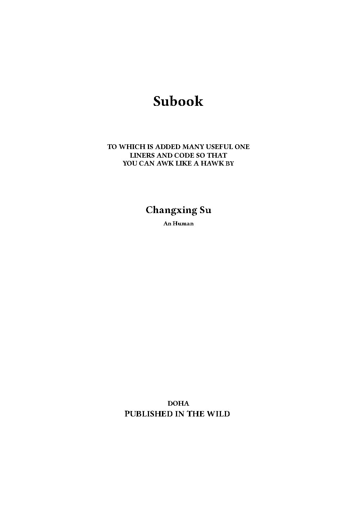
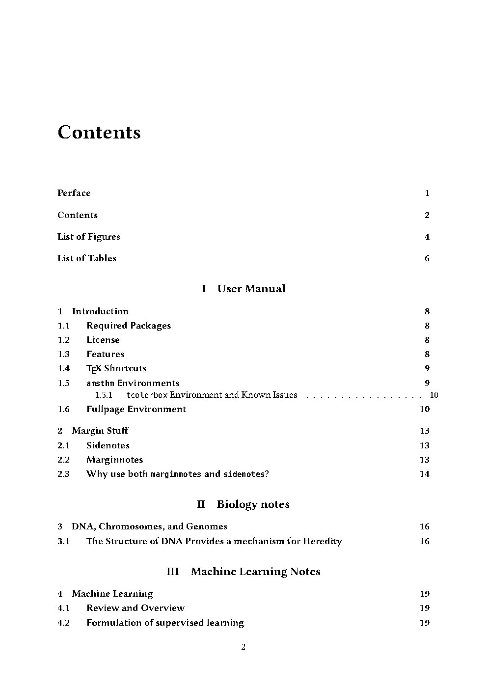
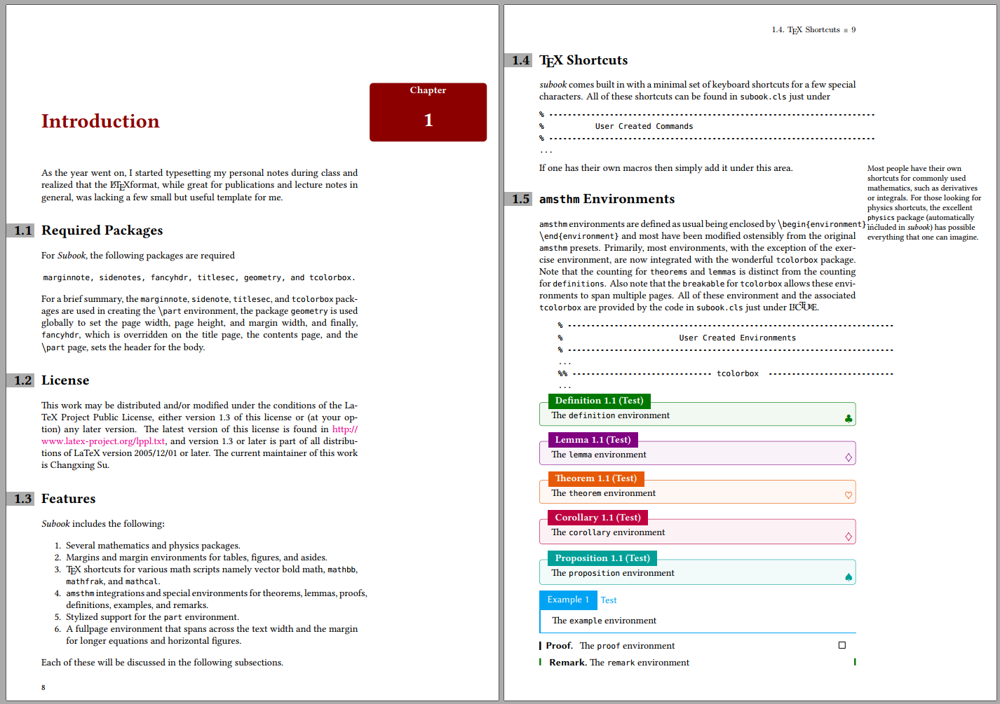
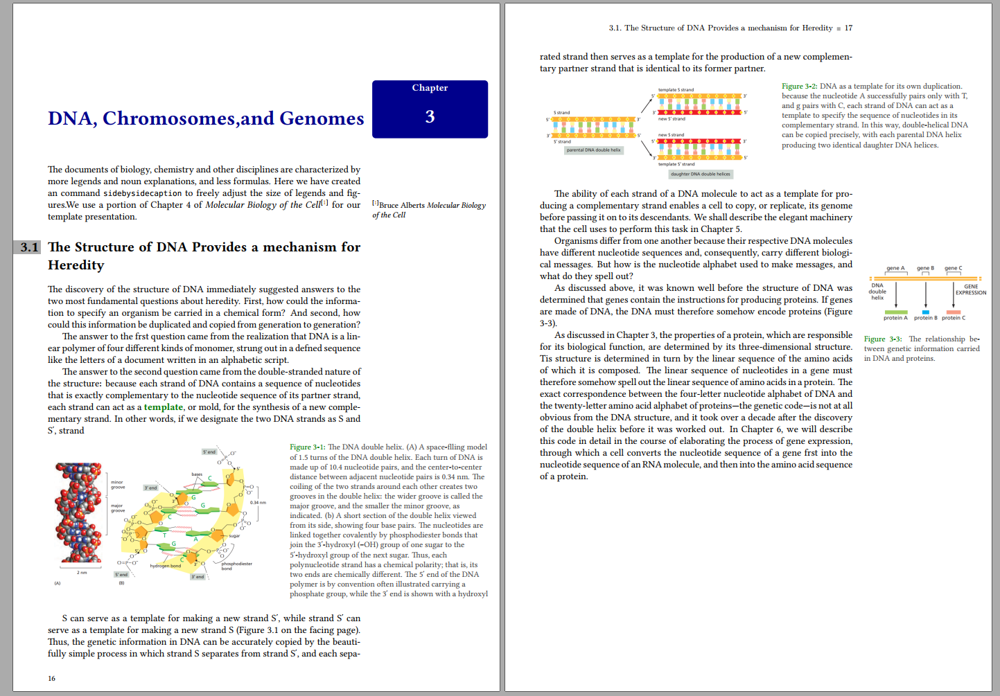
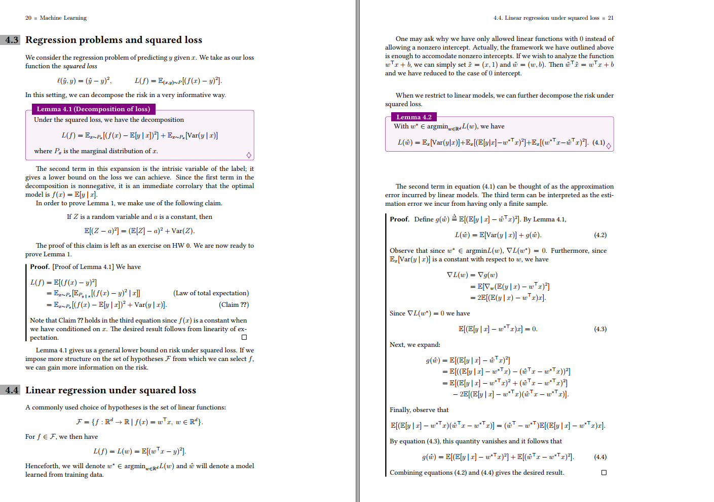

<!-- Author : Changxing Su-->

<div align="center">

#  SuBook
##  🎨 简洁精美的文档模板.

</div>

本文档模板为大家提供了一个基础版的简约版式，可以在此文档的基础上使用$\LaTeX$进行自定义构建。


模板正文包含许多示例，说明如何为各种内容利用大边距。 正文列包含彩色框、列表、代码列表、图形、表格、方程式、引用、定理等示例，作为参考，以涵盖您自己的内容的所有可能用例。 您可以在需要时简单地复制/粘贴模板中的示例之一。

## ⭐ Feature
- [x] Pre-defined and custom margin size,
- [x]  Colorful Boxes for theorem, definition,... environments
- [x] Different image placement to suit different typography styles
- [x] Oxford Press style Chapter headings, where chapter heading colors can be changed  by different Parts

TO DO：

- [ ] Summary Environment
- [ ] Indexes
- [ ] Glossaries
- [ ] Part Environment Adjusting
- [ ] Chinese language support


## 📖 Overview
|    Cover    |     Table of Contents     |
| :-----------------------: | :-----------------------: |
|  |  |


|    `Chapter` formatting and Enviorment    |    Float Figure     |
| :-----------------------: | :-----------------------: |
|  |  |

|    Biology Notes Example   |     ML Notes Example    |
| :-----------------------: | :-----------------------: |
|  |  |


## 🎯 Goal
The central focus of this template was to expand the use of **the margin** in order to include; simple marginnotes, numbered side–notes, sidecite,marginfigures, and margintables. 

The secondary motivation was to include a list of
preloaded packages and provide  elegant and colorful theorem  environment that any bioinformatics or CS students would require while type–setting notes. 

Lastly, there are a few stylistic improvements that allow for better readability.
## 🕹️ User Guide
### 🛠 Compilation
This template compiles with standard xelatex. However, you will need to compile the bibliography, index and glossary separately to the template itself.

For example, to compile a LaTeX project whose main document is `subook.tex`, use following commands for the first compilation.:
```sh
# First step: xelatex
xelatex -no-pdf --interaction=nonstopmode subook
# Second Step: biber
biber subook
# Third Step: xelatex
xelatex -no-pdf --interaction=nonstopmode subook
# Fourth Step: xelatex
xelatex --interaction=nonstopmode subook
```


## 💪 Contributing
Any contribution to add content, visualization and increase the quality of the template is much appreciated.

Post [Issues](https://github.com/chancey922/subook/issues) to report mistakes (e.g. mistakes in the compile, layout mistakes, problems with referencing)

Making [Pull requests](https://github.com/chancey922/subook/pulls) that fix any issues is very much encouraged and appreciated. Feel free to make a pull request that resolves an issue with the template and eliminates any mistakes.
## 📝 License

This work may be distributed and/or modified under the conditions of the LaTeX Project Public License, either version 1.3 of this license or (at your option) any laterversion. The latest version of this license is found [here](http://www.latex-project.org/lppl.txt), and version 1.3 or later is part of all distributions of LaTeX version 2005/12/01 or later.

## ❤️ Thanks
Actually, this class is not completely 
original, but it is a blend of all the best ideas that I have found in a 
number of guides, tutorials, blogs and tex.stackexchange.com posts. It is precisely because I am in such a friendly and open source community that I can make such a template.

## Other Further Readings
* [Why should you avoid using (complex) templates?](https://tex.stackexchange.com/questions/390683/why-should-you-avoid-using-complex-templates) 